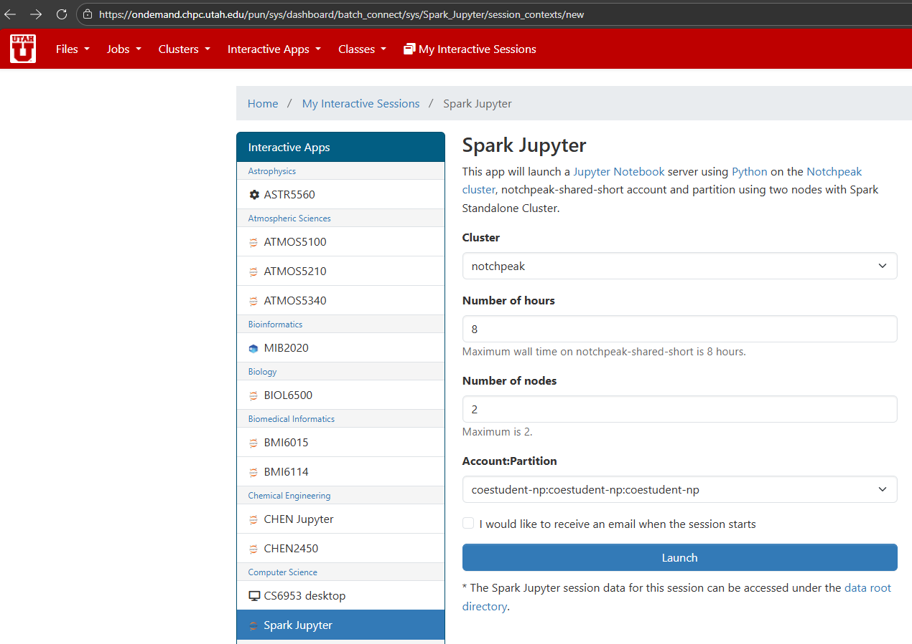
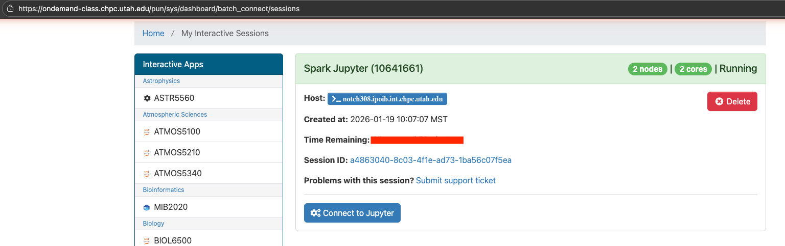
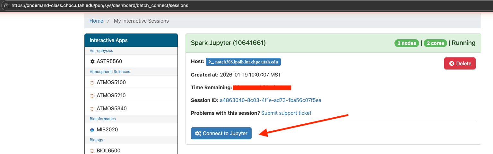
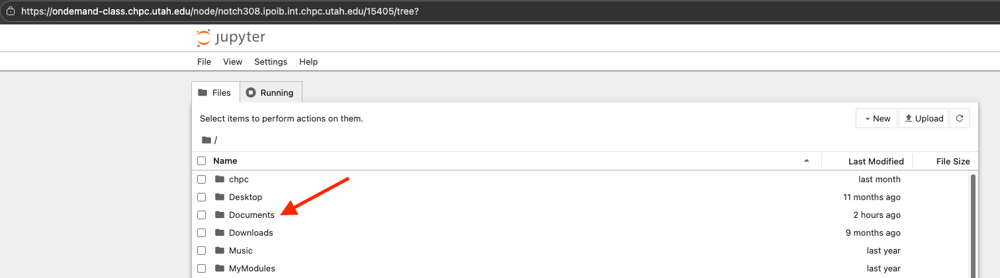
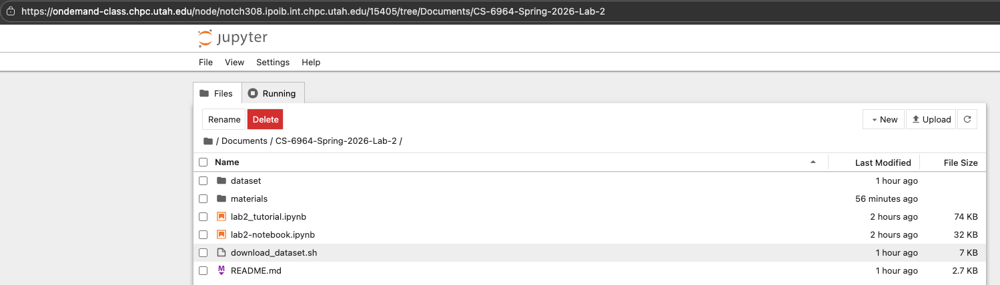
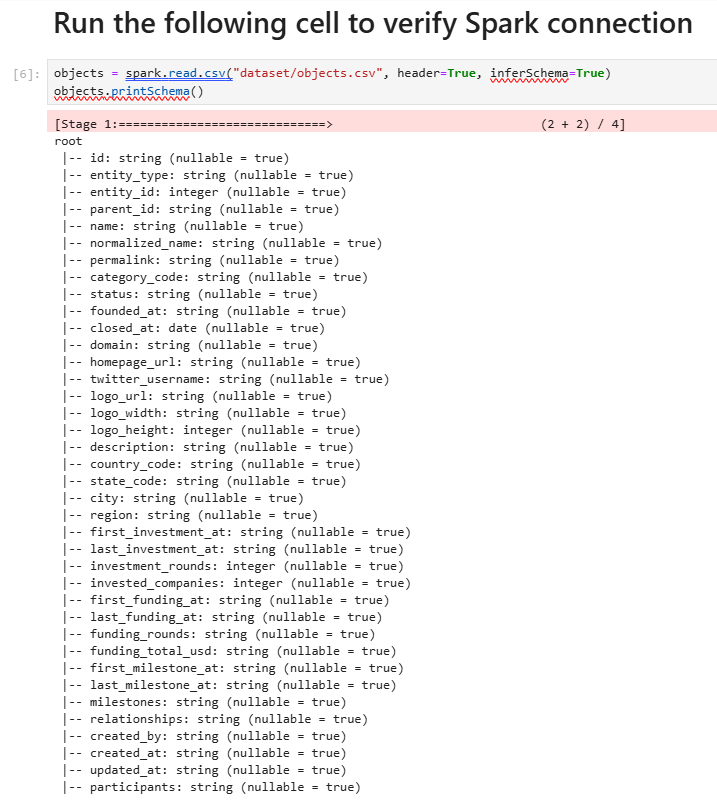
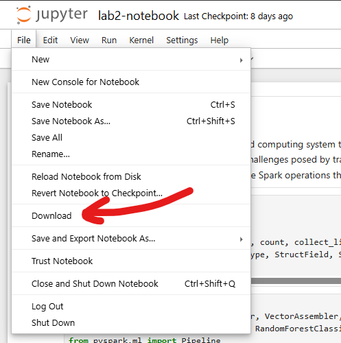

# Lab 2 - Scalable Data Processing & Introduction to Data-centric ML

## Overview

For lab2 we will be using the CHPC cluster (high-performance cluster service provided by the
University of Utah) to process the data in a distributed environment (multiple nodes). In this README.md, we will be covering on how to create a CHPC account, launch a Spark Jupyter instance, run the tutorial and ultimately what to do in the assignment

## Steps
- [Step 1: Create a CHPC account](#step-1-create-a-chpc-account)
- [Step 2: Set up resources for Lab 2](#step-2-set-up-resources-for-lab-2)
- [Step 3: Launch Spark Jupyter](#step-3-launch-spark-jupyter)
- [Step 4: Work on the assignment](#step-4-work-on-the-assignment)
- [Step 5: Verify connection](#step-5-verify-connection)
- [Step 6: Resume work after the first run](#step-6-resume-work-after-the-first-run)
- [Step 7: Submitting the Assignment](#step-7-submitting-the-assignment)

---

## Step 1: Create a CHPC account

Create a CHPC account by following this link:

https://www.chpc.utah.edu/role/user/student.php?class=CS4964

You will need this information:

- **Class**: CS4964
- **Token**: 3f1e9adee81a75e0


To verify whether the CHPC account is created, open any terminal/ command prompt from your local machine and SSH to notchpeak2 server by running in a terminal:

```bash
ssh <your uNID>@notchpeak2.chpc.utah.edu
```

You will be prompted to enter the password associated with your uNID. If the login succeeds, then CHPC is available for you to use.

---
## Step 2: Set up resources for Lab 2

In the terminal where you logged in using SSH, use the following commands to set up the project folder in CHPC.

```bash
# This command is for the students to run
mkdir -p ~/Documents
cd ~/Documents
git clone https://github.com/mirmahathir1/CS-6964-Spring-2026-Lab-2
```

After completing the above steps, you should have the following files:

1. `lab2_notebook.ipynb` -> This notebook contains the lab2 questions
2. `lab2_tutorial.ipynb` -> This notebook contains a lab2 tutorial. It is recommended you run this notebook first to familiarize yourself with the libraries/functions you need for this lab

## Step 3: Launch Spark Jupyter

You can access your jupyter notebook using the following link:

https://ondemand-class.chpc.utah.edu/pun/sys/dashboard/batch_connect/sys/Spark_Jupyter/session_contexts/new

Expected result:


Specify 2 nodes, 8 hours and `coestudent-np:coestudent-np:coestudent-np` as the `Account:Partition`. Then press `Launch`.

https://ondemand-class.chpc.utah.edu/pun/sys/dashboard/batch_connect/sessions to see if your job is running. If you see the following `Running` status, then you may proceed with solving the assignment:

Expected Result:


Important Note: After 8 hours, you will have to submit another job using [the above mentioned link](https://ondemand-class.chpc.utah.edu/pun/sys/dashboard/batch_connect/sys/Spark_Jupyter/session_contexts/new) to get additional 8 hour to work on your assignment. You may launch a spark job whenever your previous Spark job expires.

## Step 4: Work on the assignment

Press the following `Connect to Jupyter` button in [this link](https://ondemand-class.chpc.utah.edu/pun/sys/dashboard/batch_connect/sessions).



You should expect the following screen in your browser:



Double click on `Documents` and go to `CS-6964-Spring-2026-Lab-2`. You should see the following content:




## Step 5: Verify connection
Run the `lab2-notebook.ipynb` up to the following cell. If the output is the same as below, then the setup is working. You might see a long list of 'Attempting port 4XXX' warnings. That's OK as long as the cell finishes running.



If you get an error containing `PySparkRuntimeError` or a similar Python exception not matching the above output- please contact the class TAs.

## Step 6: Resume work after the first run
* Run all cells of `lab2_tutorial.ipynb` to get familiar with Spark.
* Start implementing your code in `lab2-notebook.ipynb`
* Your notebook edits are saved on CHPC whenever you press `Ctrl+S`.
* To resume where you left off, go to [Step 4](#step-4-work-on-the-assignment) and click `Connect to Jupyter`. If you don’t see a running `Spark Jupyter` job, repeat [Step 3](#step-3-launch-spark-jupyter).
* Re-run all cells from the beginning up to the last cell you completed.


## Step 7: Submitting the Assignment

After completing all tasks, download the `lab2-notebook.ipynb` notebook file with all cells successfully run.


Upload the notebook file to canvas.
